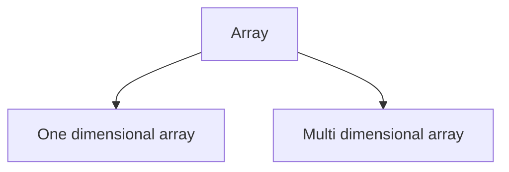
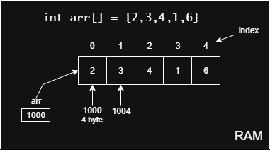

# Array List

## Arrays
- It allows storing multiple values in a single variable.
- An array is collection of elements of the same type stored in a contiguous memory allocation

```
 --- --- --- ---
| 1 | 2 | 3 | 4 |
 --- --- --- ---
```

### Key Features 
- When an array is created, it will be fixed size.
- Index based -> starting index is `0` and last index is `size-1`
- Homogeneous elements - same type 
- Contiguous memory allocation

### Basics
Types of array:


Declaring array:
```
type variable[];
```
Example:
```java
int[] marks;
```

Initialization:
```java
int[] marks={90,80,60,48,70};
```

accessing the elements
```java
int topMarks = marks[0];
```

length of an array
```java
int size = marks.length;
```
Traversing Arrays:
```java
for(int i; i < marks.length; i++){
    System.out.println(marks[i]);
}
```
enhanced for loop
```java
for(int mark: marks){
    System.out.println(mark);
}
```
Internal working of array:



Address of th ith element = base address + (ith * size of block)

```text
4 bytes = 32 bites
```

> **Example**:<br/>
> Address of 1st element = 1000 + (1*4) = 1000+4 = 1004
> <br/>
> Address of 4th element = 1000 + (4*4) = 1000+16 = 1016

Benefits of using contiguous memory with Array:
1. Efficient index based access  => Time complexity - O(1)
2. Optimised for cache performance
3. Easy to manage memory
